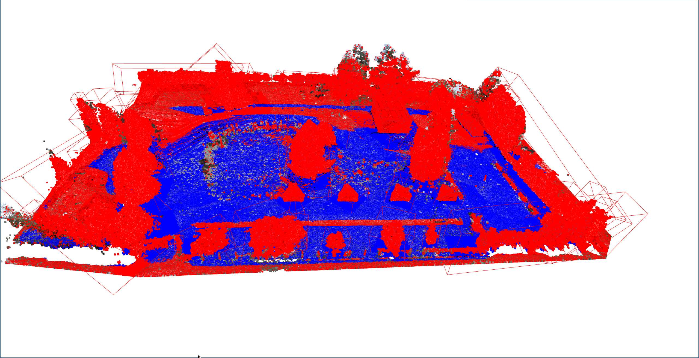

# Kickelhack Challenge - Traversability analysis -

Hackaton solution for the following task:

## Traversability analysis for outdoor/offroad scenarios
### Your mission:
An outdoor robot created a 3D-map of its environment during
an exploration phase.
The environment contains paved but also overgrown
and uneven spaces.
Develop a tool that analyzes the traversability of the
3D-map and visualize the results.
Note here that the robot has a certain
ground clearance and can overcome smaller obstacles.
## Setup

> NOTE: requires python3.8 (or python3.10)!!
>
> AUR: [python38](https://aur.archlinux.org/packages/python38)


### Setup the development environment and install [open3d](https://www.open3d.org)
```bash
python3.8 -m venv python_venv       # create venv
source python_venv/bin/activate     # and use it
pip install open3d                  # install the required library
```

> make sure to always source the venv 
> 
> `source python_venv/bin/activate`


## Usage
TODO design interface
```bash
./test.py point_cloud.pcd 
```

## Approach
-> determine parts the robot cant drive and then calculate the inverse set
1. Select statistical outlier to determine the most distant points of the main point-mass
2. Use the [RANSAC](https://en.wikipedia.org/wiki/Random_sample_consensus) algorithm to create plane segmentation of nearby points of those outlier
-> this creates planes of big objects, a robot can't drive over
3. To extract those from the main point-cloud, the 'outlier-objects' get clustered with [DBSCAN](https://en.wikipedia.org/wiki/DBSCAN)
4. Around the clustered data a bounding box is created and the cross-section is extracted from the point-cloud to reduce the possible planes
5. Finally RANSAC is called again on the reduced data to determine the drivable plain


